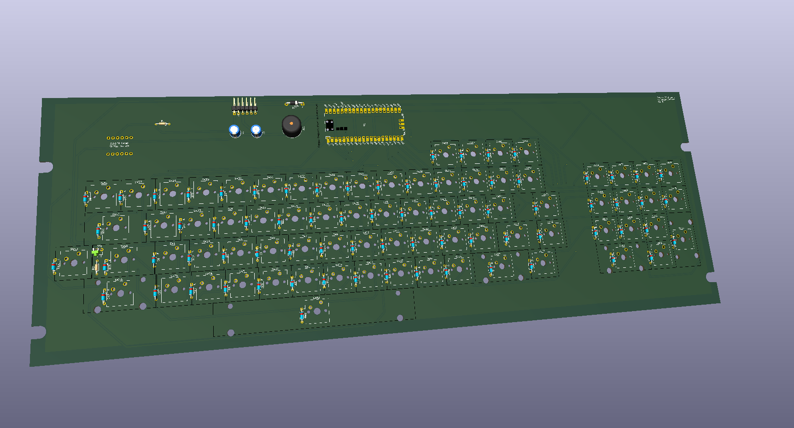
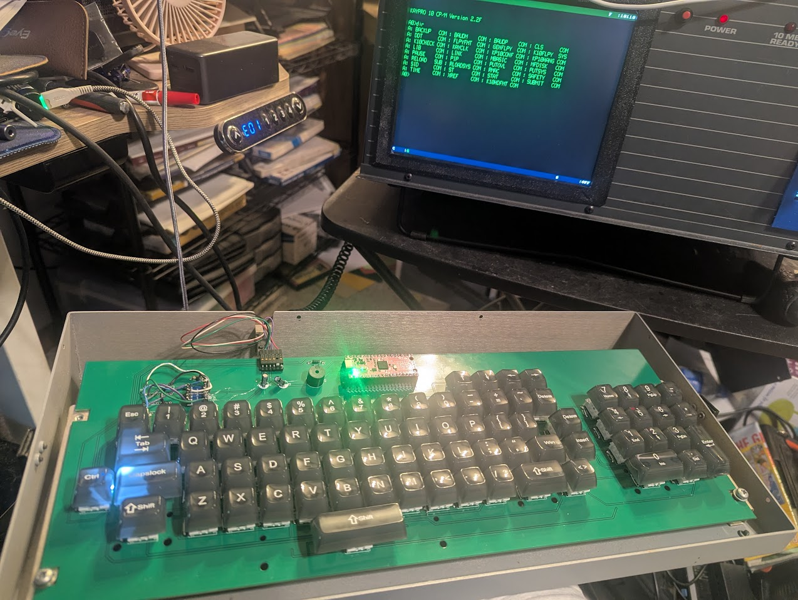

# Kaypro 10 Replacement Keyboard

A modern replacement keyboard for the Kaypro 10 that fits the original case, using Cherry MX-style switches and a Raspberry Pi Pico running MicroPython to emulate the original 300 baud serial keyboard interface.



*KiCad 3D render of the PCB*



*Prototype board installed and working*

---

## Overview

The original Kaypro 10 keyboard is increasingly difficult to find in working condition. This project provides a drop-in replacement that:

- Fits the original Kaypro 10 keyboard case with no modifications
- Uses modern Cherry MX-style mechanical switches
- Communicates over the Kaypro's original 300 baud serial keyboard interface
- Is driven by a Raspberry Pi Pico running MicroPython
- Includes a 3D printed switch support plate (no metal plate in this design)

---

## Repository Contents

All files are in the root of the repository.

| File | Description |
|------|-------------|
| `*.kicad_pro`, `*.kicad_sch`, `*.kicad_pcb`, etc. | KiCad 10 schematic and PCB design files |
| `KayproKeyboard.zip` | Generated Gerber/manufacturing files, ready to send to a PCB fab |
| `KayproKeyboard.png` | KiCad 3D render of the board |
| `keyboard support.stl` | 3D printable switch support plate |
| `main.py` | MicroPython firmware for the Raspberry Pi Pico |
| `PXL_20260531_222427528.jpg` | Photo of the working prototype |

---

## Bill of Materials

| Qty | Component | Notes |
|-----|-----------|-------|
| 76 | 1N4148 diode | One per switch, for key matrix decoding |
| 76 | Cherry MX-style switches | One per key position |
| — | PCB-mount stabilizers | Required for larger keys (spacebar, shift, enter, etc.) — quantity depends on layout |
| 1 | Waveshare BS138 4-channel bidirectional level shifter module | 3.3V ↔ 5V logic level conversion |
| 1 | Passive buzzer/speaker | Key click feedback |
| 1 | LED (single, any color) | Status indicator |
| 1 | 330Ω resistor | LED current limiting |
| 1 | 47kΩ resistor | Pull-up/pull-down for serial line |
| 1 | Protection diode | 5V input protection for the Pico |
| 1 | Raspberry Pi Pico | Main controller (standard Pico, not Pico W) |
| 1 | 6-pin horizontal header | Serial interface connector to Kaypro mainboard |

> **Note:** Use 1N4148 diodes (or equivalent) for the key matrix. One diode is required per switch to prevent ghosting.

---

## PCB Manufacturing

The file `KayproKeyboard.zip` contains all Gerber files needed for fabrication. It can be uploaded directly to most PCB manufacturers (JLCPCB, PCBWay, OSHPark, etc.) without modification.

Recommended specs:
- **Layers:** 2
- **Thickness:** 1.6mm
- **Surface finish:** HASL or ENIG

---

## 3D Printed Support

Because this design does not use a metal switch plate, a 3D printed support structure (`keyboard support.stl`) is included to provide rigidity and hold the switches in alignment during soldering and use.

Print in PLA or PETG at 0.2mm layer height with at least 20% infill. No supports should be needed.

---

## Firmware

The Pico runs MicroPython. Copy `main.py` to the Pico's root filesystem and it will start automatically on boot.

### Flashing the Pico

1. Hold the BOOTSEL button and connect the Pico to your computer via USB.
2. It will appear as a USB mass storage device (`RPI-RP2`).
3. Flash the latest [MicroPython UF2](https://micropython.org/download/rp2-pico/) by dragging it onto the drive.
4. Once rebooted, use a tool like [Thonny](https://thonny.org/) or `mpremote` to copy `main.py` to the Pico:
   ```
   mpremote cp main.py :main.py
   ```

The firmware reads the key matrix, debounces inputs, and outputs the correct character codes over the serial interface at 300 baud to match the Kaypro's original keyboard protocol.

---

## Connector Pinout

The keyboard connects to the Kaypro 10 mainboard via a 6-pin horizontal header. Pinout, numbered left to right:

| Pin | Signal | Description |
|-----|--------|-------------|
| 1 | 5V | Power from Kaypro mainboard |
| 2 | TX | Serial data out — keyboard → Kaypro, 300 baud |
| 3 | GND | Ground |
| 4 | GND | Ground |
| 5 | — | Missing/keyed pin (no connection) |
| 6 | RX | Serial data in — Kaypro → keyboard, 300 baud |

> ⚠️ **Important:** This pinout was determined from an **1983-spec Kaypro 10**. It may not be universal across all Kaypro models or revisions. Verify against your own machine before connecting. The protection diode on the 5V input and the BS138 level shifter are strongly recommended to avoid damaging the Pico.

The BS138 level shifter module handles 3.3V Pico ↔ 5V Kaypro logic translation on the TX and RX lines.

---

## Design Files

Schematics and PCB layout were created in **KiCad 10**. The KiCad project files are in the root directory and can be opened and modified freely.

---

## License

This project is open source. Schematics, PCB files, firmware, and mechanical files are provided as-is for personal and educational use.

Contributions, improvements, and ports to other Kaypro models are welcome — open a PR or issue!
